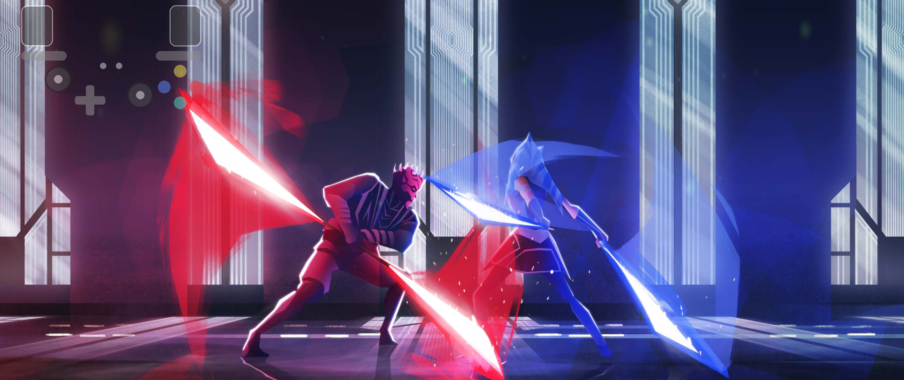
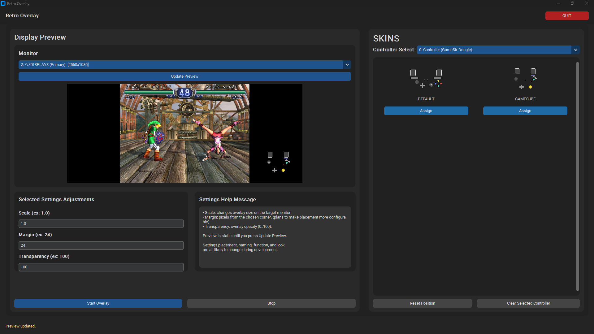
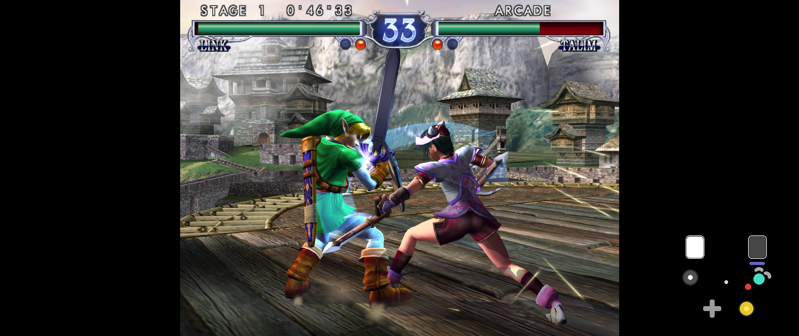
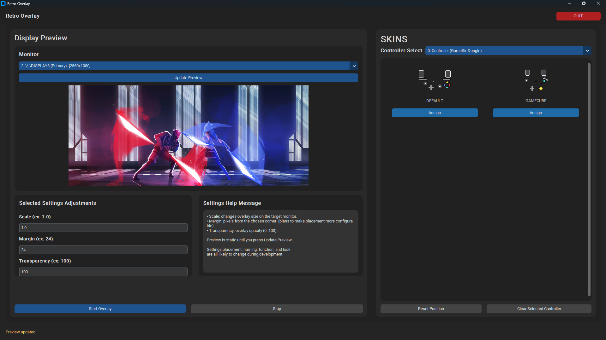
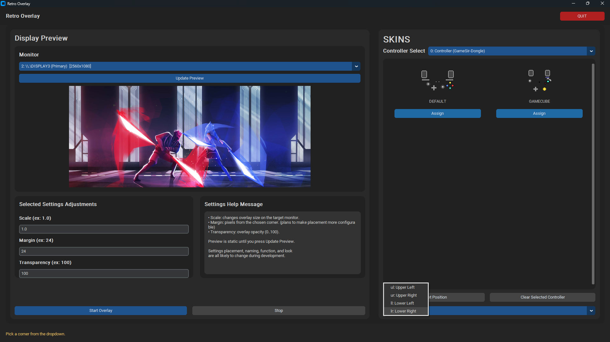

# 🎮 Retro Overlay
Disclaimer: I have only tested this with an Xbox Controller, I originally made this for seeing what buttons I was pressing when emulating games.

# A customizable & real-time-input controller overlay built in Python.
# Retro Overlay lets you display animated controller inputs on any monitor.
# Perfect for streaming, recording, emulator gameplay, tutorials, or personal setup customization.

---

## ✨ Features

- 🎮 Can overlay up to 4 controllers at once
- 📍 Corner-based placement (UL / UR / LL / LR)  
- 📏 Adjustable scale  
- 🧭 Adjustable margin  
- 🔍 Adjustable transparency  
- 🖥️ Multi-monitor support  
- ⚡ Lightweight real-time rendering
- 🤗 Runs completely independently of any game or app. It just forces the overlay to the front of whichever monitor.

---

# 🖥️ In Desktop View

The main control panel allows you to:

- Select which monitor to target
- Preview overlay position
- Adjust scale, margin, and transparency
- Assign skins to connected controllers
- Start and stop the overlay

---

# 🎛 Settings Adjustments

Fine tune how your overlay appears:

| Setting | Description |
|----------|-------------|
| **Scale** | Changes overlay size |
| **Margin** | Distance from selected corner |
| **Transparency** | Overlay opacity (0–100) |

Preview updates before launching.

---

# 🎥 Overlay Running (Emulator Example)

<em>Emulator: Dolphin&nbsp;&nbsp;&nbsp;&nbsp;&nbsp;&nbsp;&nbsp;&nbsp;Game: SoulCaliber 2</em>

The overlay renders transparently over your selected monitor while remaining lightweight and responsive.

---

# ⚙️ Additional UI States

## Settings Example 1

## Settings Example 2

## Settings Example 3

---

# 🚀 Installation

## To run the actual overlay, all you need is the exe file in the dist folder

## Clone the Repository and download python along with the necessary dependencies if you want to try to make your own controller layout, just leave it in the skins folder (same folder that default.py and gamecube.py are in). Keep in mind you will need to rebuild the app, or get in contact with me on Discord  @_Moyamoya_Boy_, and I can add your custom skin to the main build for future updates.

# 📅✍️ Plans

## I honestly don't know how far I plan to take this right now, but I don't plan to stop adding things anytime soon.

## Besides cleaning the code up some more, I am also working on a way to have the controller input control mouse movement, the testing code I have for that is in this version of the project. Just run the the python file directly from the cmd line to test. 

## Also, the set_primary.py is a helper program I wrote to quickly change my main desktop display and I added it here because I thought others would find it convenient.

# 🏎️ Development Roadmap

## Update Preview occurs anytime user changes a setting (remove the button basically)
### > Core logic already there, just need to alter when the function needs to run

## Create more skins
### > Gonna do this as I'm working on the things below, probably will work on getting basic shapes created first to make this easier
### > More skins coming whenever next major update to the overlay will happen

## Test Playstation and Switch controllers with program and debug if neccessary for those.
### > Just got to get the controllers from my siblings

## Getting controller_to_mouse.py functioning, and adding a toggle function to use it with overlay
### > I just want to do this, has nothing to do with overlay but is a function I think most users would like.

## Create more shapes for easier gamepad skin creation.
### > First create more standard shapes, then more complex
### > Idea is for user to swap out button shapes with prebuilt ones in controller designer

## Add a "Create your own" or " + " to the Skins tab to let users easily create their own without needing to program their own
### > a button mapping subprogram for users to test their controllers input codes, and match buttons to those codes (for users who use emulator specific controllers [e.g. Standard Joysticks, Gamecube, Wii])
### > a way for users to "say" which button codes trigger which buttons on the overlay.  → Easier controller design is the end goal here

## IF YOU HAVE ANY SUGGESTIONS MESSAGE ME ON DISCORD @MOYAMOYA_BOY
